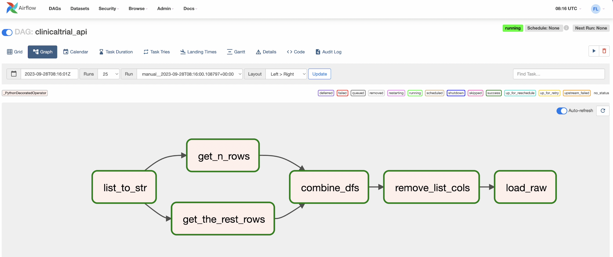
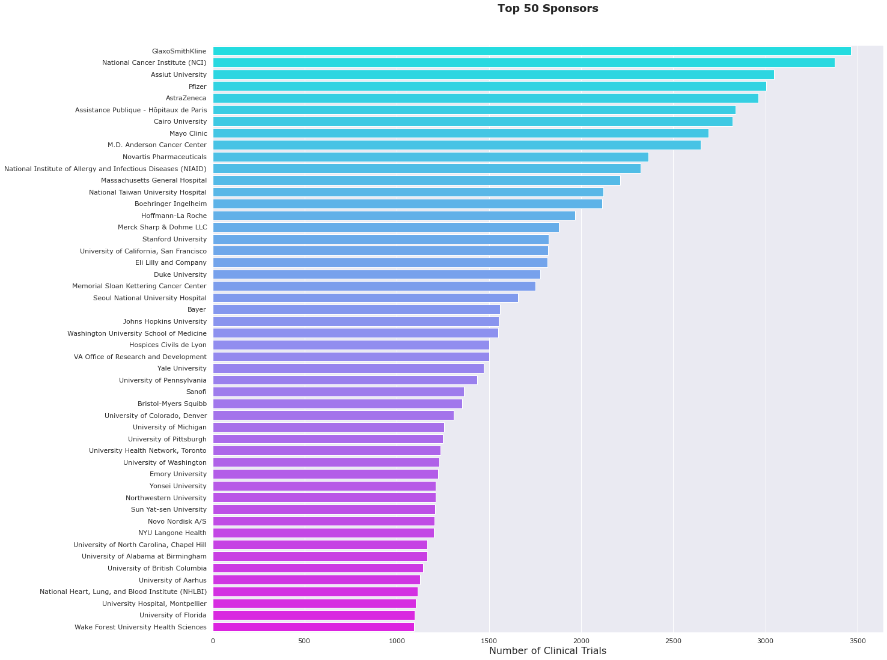
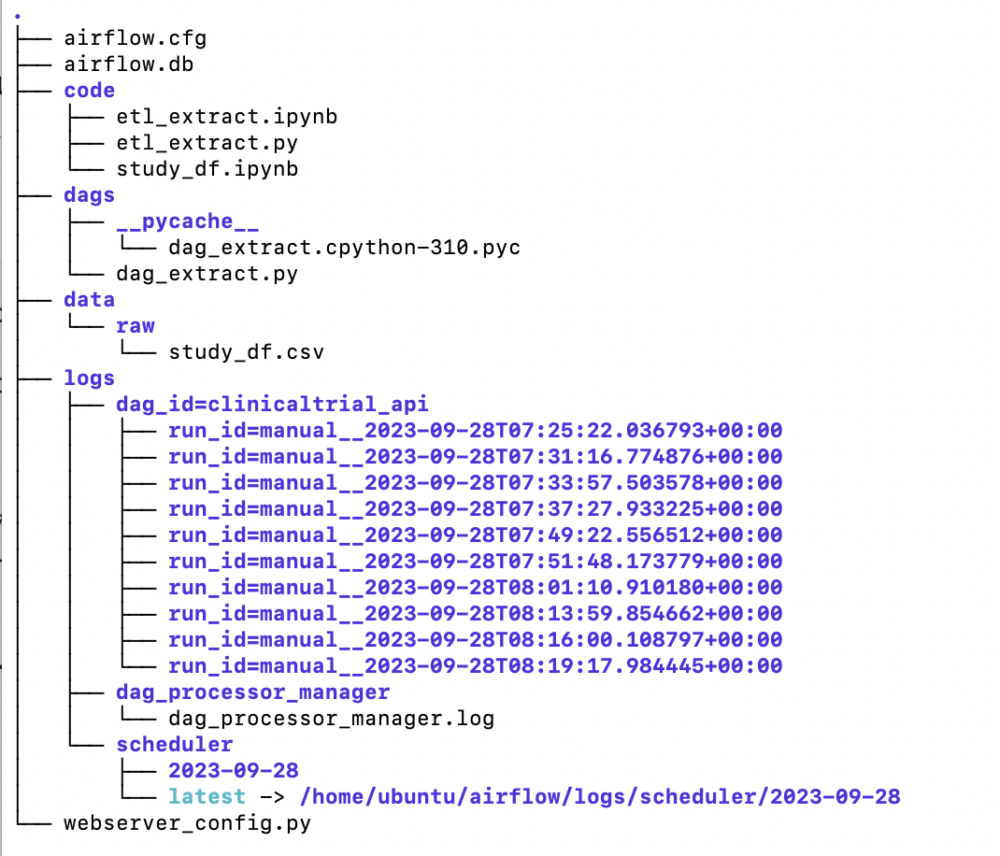
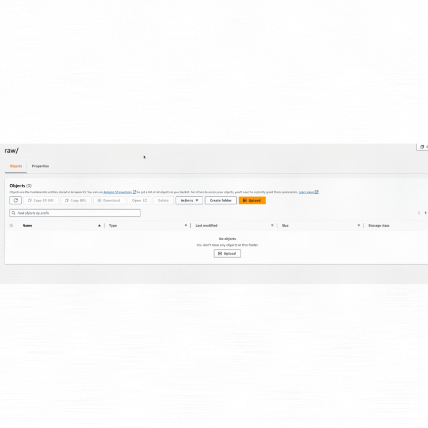

# Clinical Trials 
- Pulled historical and current clinical trials data from ClinicalTrials.gov database using API requests.
- Transformed using Pandas and scheduled using AirFlow on AWS EC2 instance and stored the data in AWS S3.
- Set proper IAM roles, policies, security groups on AWS cloud for connections.
  

 
